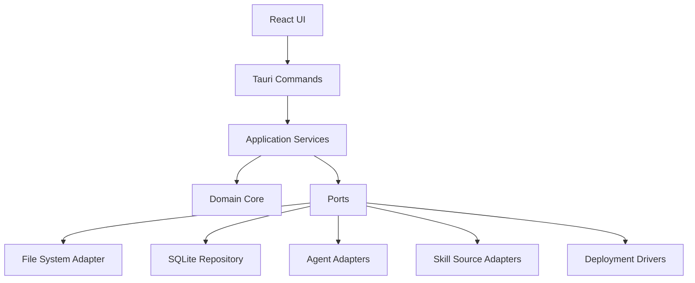

# SkillArk 总体架构设计

## 1. 架构原则

1. **领域核心不依赖 Tauri UI**：后续 CLI、测试工具和服务端可复用。
2. **Agent 通过 Adapter 扩展**：不得在业务代码中散落平台判断。
3. **来源和分发解耦**：Skill 从哪里来，不影响如何安装。
4. **确定性程序负责写文件**：AI 只提供建议，不直接执行任意命令。
5. **所有写操作可审计**：操作计划、结果和错误均落库。
6. **先支持规范 Skill，再处理兼容格式**。

## 2. 推荐分层



## 3. 模块边界

### 3.1 Domain Core

仅包含纯业务对象和规则：

- Skill
- SkillVersion
- AgentInstallation
- Workspace
- Deployment
- Operation
- ValidationReport

不得直接访问文件系统、数据库或网络。

### 3.2 Application Services

建议服务：

- `ImportSkillService`
- `DiscoverAgentsService`
- `CreateWorkspaceService`
- `PlanDeploymentService`
- `ExecuteDeploymentService`
- `VerifyDeploymentsService`
- `UninstallDeploymentService`

### 3.3 Ports

```rust
trait SkillRepository {}
trait AgentRepository {}
trait WorkspaceRepository {}
trait DeploymentRepository {}
trait OperationRepository {}
trait AgentAdapter {}
trait SkillSourceAdapter {}
trait DeploymentDriver {}
trait FileHasher {}
trait Clock {}
```

### 3.4 Adapters

- SQLite repositories
- Windows filesystem
- Junction driver
- Copy driver
- Claude Code adapter
- Cursor adapter
- Codex adapter
- WorkBuddy adapter
- Custom adapter
- Local directory source
- ZIP source
- GitHub source（v0.2）

## 4. 建议目录结构

```text
src-tauri/src/
├── domain/
│   ├── skill.rs
│   ├── agent.rs
│   ├── workspace.rs
│   ├── deployment.rs
│   └── operation.rs
├── application/
│   ├── import_skill.rs
│   ├── discover_agents.rs
│   ├── plan_deployment.rs
│   ├── execute_deployment.rs
│   └── verify_deployment.rs
├── ports/
│   ├── repositories.rs
│   ├── agent_adapter.rs
│   ├── skill_source.rs
│   └── deployment_driver.rs
├── adapters/
│   ├── sqlite/
│   ├── filesystem/
│   ├── agents/
│   ├── sources/
│   └── deployment/
├── commands/
└── lib.rs
```

前端建议：

```text
src/
├── app/
├── pages/
├── features/
│   ├── skills/
│   ├── agents/
│   ├── workspaces/
│   ├── deployments/
│   └── settings/
├── shared/
└── api/
```

## 5. Canonical Skill 模型

SkillArk 内部先统一为 Agent Skills 兼容结构：

```text
skill-root/
├── SKILL.md
├── scripts/
├── references/
├── assets/
└── other-files/
```

内部不依赖某个 Agent 的安装目录。Agent Adapter 只负责目标路径和必要转换。

## 6. 分发计划模型

任何安装必须先生成只读计划：

```json
{
  "operationId": "...",
  "skillVersionId": "...",
  "targets": [
    {
      "agentId": "...",
      "workspaceId": "global-default",
      "targetPath": "...",
      "mode": "copy",
      "conflict": "none"
    }
  ],
  "warnings": [],
  "requiresConfirmation": false
}
```

执行器只接受结构化计划，不接受任意 Shell 字符串。

## 7. 事务边界

数据库事务无法覆盖文件系统，因此采用补偿式事务：

1. 创建 Operation，状态 `running`
2. 在目标同级创建临时目录
3. 完成复制或链接
4. 校验内容 Hash 和结构
5. 原子替换目标
6. 写入 Deployment
7. Operation 标记 `succeeded`
8. 失败则删除临时目录并恢复备份

## 8. 后续扩展点

v0.2 后增加：

- Registry Connector
- Git repository cache
- Security Scanner
- Compatibility Engine
- Install Plan AI Assistant
- Lockfile

这些模块不得修改 v0.1 的核心 Skill、Agent、Workspace、Deployment 边界。
