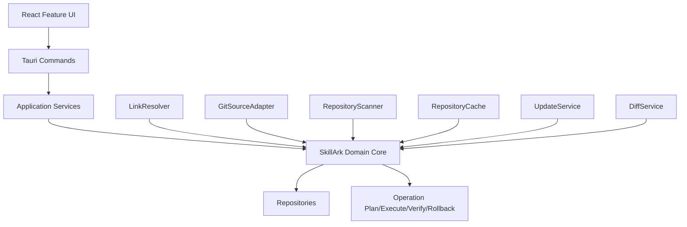
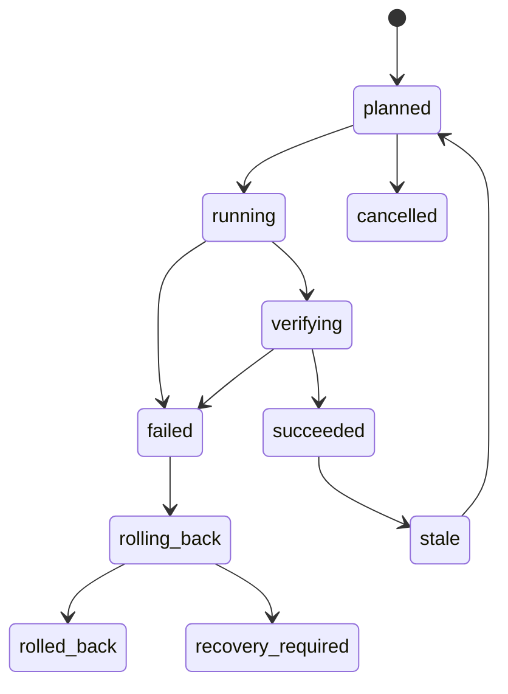

# SkillArk v0.2 架构详细设计

## 1. 架构目标

把外部 Git 来源确定性地转化为可追溯的本地 Skill 版本。

## 2. 架构约束

- Domain Core 不依赖 Tauri、UI、具体 Hub、具体模型或平台命令。
- 新模块通过 Application Service 与 Port 接入既有 Skill/Version/Operation。
- 文件、网络、模型、扩展和环境操作都必须可取消并有资源预算。
- 任何远端或概率结果进入数据库前必须带来源和证据版本。

## 3. 组件关系



## 4. 模块边界

### LinkResolver

**职责：** 把输入规范化为 RepositoryLocator，不访问业务数据库。

**输入约束：** 只接受规范化 DTO 或 ID，不接收未经解析的任意字符串作为副作用参数。

**输出约束：** 返回结构化结果、证据、警告和可恢复错误；不得吞掉部分失败。

### GitSourceAdapter

**职责：** 获取 refs、归档或浅克隆，并返回不可变 SourceRevision。

**输入约束：** 只接受规范化 DTO 或 ID，不接收未经解析的任意字符串作为副作用参数。

**输出约束：** 返回结构化结果、证据、警告和可恢复错误；不得吞掉部分失败。

### RepositoryScanner

**职责：** 在受限目录内发现 SKILL.md，构建候选项和共享资源边界。

**输入约束：** 只接受规范化 DTO 或 ID，不接收未经解析的任意字符串作为副作用参数。

**输出约束：** 返回结构化结果、证据、警告和可恢复错误；不得吞掉部分失败。

### RepositoryCache

**职责：** 按 remote + revision 缓存，支持 LRU 与完整性校验。

**输入约束：** 只接受规范化 DTO 或 ID，不接收未经解析的任意字符串作为副作用参数。

**输出约束：** 返回结构化结果、证据、警告和可恢复错误；不得吞掉部分失败。

### UpdateService

**职责：** 比较已安装 revision 与远端 revision，生成更新计划。

**输入约束：** 只接受规范化 DTO 或 ID，不接收未经解析的任意字符串作为副作用参数。

**输出约束：** 返回结构化结果、证据、警告和可恢复错误；不得吞掉部分失败。

### DiffService

**职责：** 生成文本/文件树差异；二进制仅显示 Hash 与大小变化。

**输入约束：** 只接受规范化 DTO 或 ID，不接收未经解析的任意字符串作为副作用参数。

**输出约束：** 返回结构化结果、证据、警告和可恢复错误；不得吞掉部分失败。

## 5. 推荐目录

```text
src-tauri/src/
├── domain/
├── application/link_bridge/
├── ports/
├── adapters/
├── infrastructure/
├── commands/
└── migrations/

src/features/link-bridge/
├── api/
├── components/
├── pages/
├── state/
└── tests/
```

## 6. 应用服务

- `PlanV0.2LinkBridgeService`：生成纯计划和警告，不产生外部副作用。
- `ExecuteV0.2LinkBridgeService`：只接受计划 ID，重新校验前置条件。
- `VerifyV0.2LinkBridgeService`：用 Hash、revision、证据或实际目标验证结果。
- `RollbackV0.2LinkBridgeService`：使用补偿记录恢复前一可用状态。
- `DiagnoseV0.2LinkBridgeService`：返回结构化原因、证据和建议动作。

## 7. 状态机



## 8. 错误模型

每个错误必须包含：

```json
{
  "code": "STABLE_MACHINE_CODE",
  "stage": "plan|fetch|parse|scan|execute|verify|rollback",
  "retryable": false,
  "user_action": "可执行的下一步",
  "evidence": [],
  "cause_chain": []
}
```

禁止把原始异常文本作为唯一 UI 信息。

## 9. 资源与并发

- 网络、扫描、Hash、索引和环境操作放入后台任务队列。
- 同一 SkillVersion/目标路径的写操作串行化。
- 不同来源、不同环境、不同目标可并行，但结果独立提交。
- 所有任务支持取消；取消后不得把临时状态标为成功。

## 10. 安全边界

- 所有路径 canonicalize 后再比较允许根目录。
- 外部包、扩展、模型输出默认不可信。
- 凭据只通过引用传递，不进入 DTO、日志或诊断正文。
- 临时目录、缓存与派生版本使用内容 Hash 验证。
