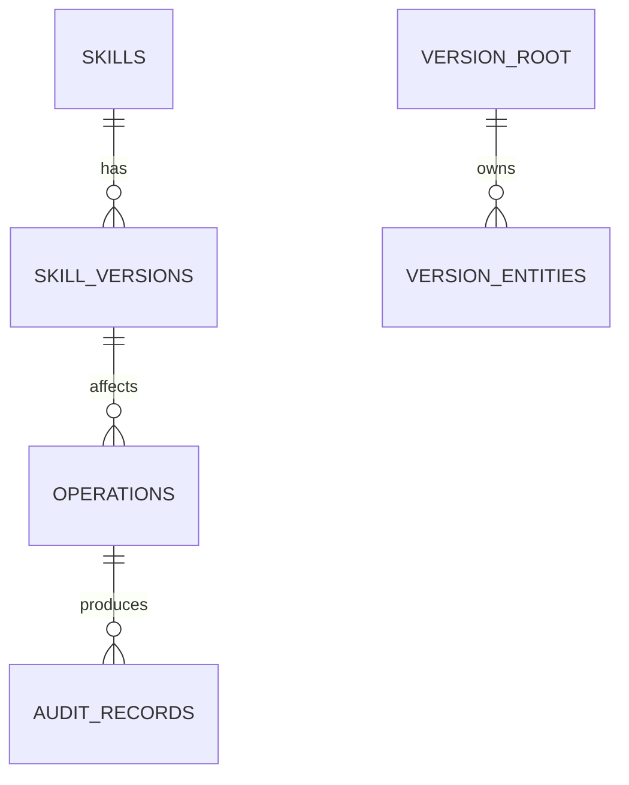

# SkillArk v0.9 数据模型详细设计

## 1. 设计原则

1. 外部身份、内部稳定身份和不可变版本分离。
2. 频繁过滤的字段不得只放 JSON；原始来源字段可保留在 `raw_json`。
3. 报告、计划和执行结果绑定生成器版本和输入 Hash。
4. 删除采用软删除或状态迁移；真正清理通过独立 GC 任务。
5. 所有迁移在执行前备份数据库，并写入 `migration_history`。

## 2. 新增实体

| 实体 | 类型 | 通用约束 | 备注 |
|---|---|---|---|
| migration_history | 本版本新增 | 使用 TEXT UUID/ULID 主键；含 created_at/updated_at；核心状态使用独立列。 | 具体字段见迁移草案 |
| backup_snapshots | 本版本新增 | 使用 TEXT UUID/ULID 主键；含 created_at/updated_at；核心状态使用独立列。 | 具体字段见迁移草案 |
| recovery_actions | 本版本新增 | 使用 TEXT UUID/ULID 主键；含 created_at/updated_at；核心状态使用独立列。 | 具体字段见迁移草案 |
| diagnostic_exports | 本版本新增 | 使用 TEXT UUID/ULID 主键；含 created_at/updated_at；核心状态使用独立列。 | 具体字段见迁移草案 |
| telemetry_preferences | 本版本新增 | 使用 TEXT UUID/ULID 主键；含 created_at/updated_at；核心状态使用独立列。 | 具体字段见迁移草案 |
| telemetry_events | 本版本新增 | 使用 TEXT UUID/ULID 主键；含 created_at/updated_at；核心状态使用独立列。 | 具体字段见迁移草案 |
| crash_events | 本版本新增 | 使用 TEXT UUID/ULID 主键；含 created_at/updated_at；核心状态使用独立列。 | 具体字段见迁移草案 |
| onboarding_progress | 本版本新增 | 使用 TEXT UUID/ULID 主键；含 created_at/updated_at；核心状态使用独立列。 | 具体字段见迁移草案 |

## 3. 关系原则

`VERSION_ROOT` 代表本版本核心聚合根；实际表通过外键指向 SkillVersion、Source、AgentInstallation、Environment 或 Extension。

## 4. 字段约束

- URL 分为 `display_url` 和规范化 `canonical_locator`；不得用展示 URL 作为唯一键。
- 远端版本至少保存 `source_revision`、`resolved_revision` 和 `content_hash`。
- 报告保存 `status=complete|incomplete|failed`，incomplete 不得等同通过。
- JSON 字段必须有 `schema_version`。
- 凭据表只保存安全存储引用，不保存明文。

## 5. 索引策略

- 所有外键建立索引。
- 状态 + 更新时间建立组合索引，支持任务恢复。
- 内容 Hash、canonical locator、resolved revision 建立唯一或候选唯一索引。
- 搜索文本使用 FTS 表，不在业务表中做 `%LIKE%` 全表扫描。

## 6. 迁移

迁移草案：`design/sql/0009_v0_9_public_beta.sql`

执行顺序：

1. `BEGIN IMMEDIATE` 前完成磁盘与备份预检。
2. 新建表/列，不在同一迁移中删除旧字段。
3. 回填可重复执行，并记录进度。
4. 新版本代码双读或兼容读一个过渡周期。
5. 验证行数、外键、Hash 和关键查询。
6. 标记迁移成功；失败恢复备份并进入安全模式。

## 7. 数据保留

- 不可变 SkillVersion、来源修订和策略覆盖保留审计记录。
- 临时下载、模型上下文和诊断包按明确 TTL 清理。
- 用户可删除遥测本地队列、AI 运行记录和缓存；删除不应破坏部署可验证性。
