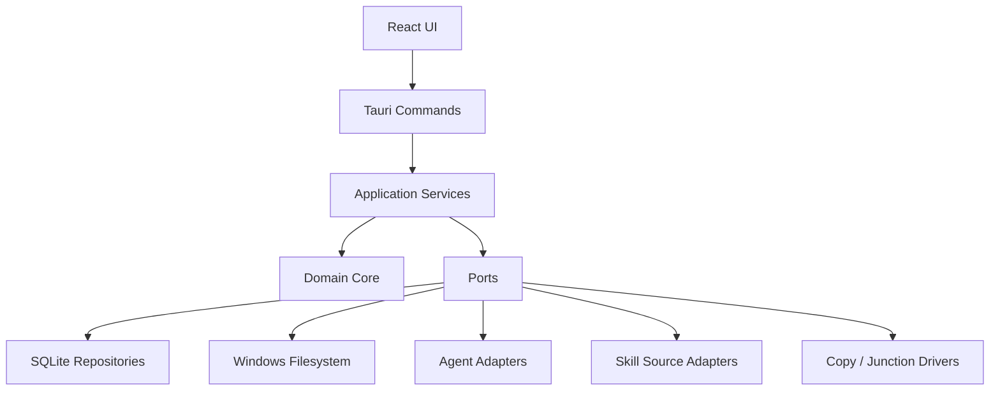

# SkillArk v0.1 项目启动 · 方案设计

## 交付路径对比

| 维度 | A：架构优先、POC 驱动 | B：端到端薄切片 | C：UI 原型优先 |
|---|---|---|---|
| 做法 | 先冻结领域边界和契约，再做 Agent 与分发 POC，最后接 UI | 先完成单 Agent、单 Skill 的完整路径，再横向扩展 | 先做页面与交互，后补真实后端 |
| 优点 | 优先消除 Windows 文件系统与多 Agent 路径风险；领域核心可复用 | 较早得到可操作成品；集成反馈快 | 视觉反馈最快，便于产品讨论 |
| 缺点 | 前几天可见 UI 较少 | 容易让首个 Agent/路径假设渗入核心模型 | 核心风险验证晚，返工概率最高 |
| 适合场景 | 技术和安全风险主导的新项目 | 领域已稳定、集成风险较低 | 需求探索和演示优先 |
| 预计返工风险 | 低 | 中 | 高 |

定稿：选择 A。设计包已经明确 Domain/Ports/Adapters 边界，且主要不确定性集中在 Windows Agent 探测、Junction、路径安全与补偿式事务；应先用 POC 消除这些风险。

## 总体架构

约束：

- Domain Core 不依赖 Tauri、文件系统、数据库或网络。
- Agent 类型差异只存在于 Adapter。
- Skill 来源与部署方式解耦。
- 执行器只接受通过 Schema 校验的结构化 DeploymentPlan。
- 文件系统和数据库通过补偿式事务协调。

## 技术选型

| 领域 | 选型 | 理由 |
|---|---|---|
| 桌面框架 | Tauri 2 | 设计基线明确；Rust 后端适合路径和文件系统安全逻辑 |
| 前端 | React + TypeScript | 与设计基线一致，适合向导和多状态页面 |
| 后端 | Rust | 类型安全、跨模块契约清晰、适合可取消的文件操作 |
| 数据库 | SQLite | 本地优先、单机部署简单 |
| SQLite 访问 | 优先验证 sqlx | migrations 与异步服务契合；M0 POC 后冻结 |
| 版本判断 | SHA-256 稳定目录 Hash | 可重复，不受 mtime 影响 |
| 默认部署 | Copy | 权限和运行时行为最可预测 |
| 高级部署 | Windows Junction | 允许中央版本即时生效，但需单独验证路径边界 |

## 契约冻结建议

1. 外部 JSON 使用 camelCase；Agent 类型字段统一为 `agentType`。
2. v0.1 总是创建固定 Global Workspace，DeploymentPlan 中 `workspaceId` 非空。
3. `synced_after_external_update` 不进入持久状态集合，变化原因进入 VerifyResult。
4. GitHub 来源相关 Port 可以预留，但 v0.1 不实现、不展示入口。
5. 所有 Schema 增加正反例测试，并由 Rust DTO 序列化结果参与契约测试。

## 安全设计

- ZIP 解压前规范化每个条目路径并验证仍位于目标根目录，阻止 Zip Slip。
- 导入和复制不跟随逃出 Skill 根目录的链接或重解析点。
- 拒绝磁盘根目录、用户主目录、系统目录作为部署目标。
- Copy 使用同级临时目录、Hash 校验、备份和原子替换。
- 卸载修改过的 Copy 目标时默认保留，并提供解除管理、导回新版本或强制删除三种显式选择。
- 日志不记录 Token、敏感环境变量或 Skill 文件敏感内容。
