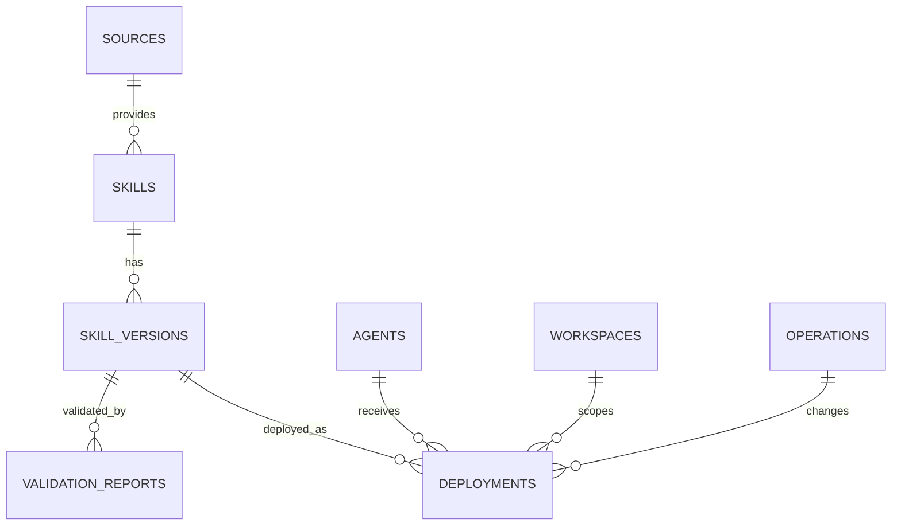

# SkillArk 数据模型设计

## 1. 核心关系



## 2. 表说明

### skills

Skill 的稳定身份，不直接表示某次具体内容。

重要字段：

- `canonical_name`
- `display_name`
- `description`
- `format`
- `library_path`
- `current_version_id`
- `status`

### skill_versions

保存 Skill 的不可变版本快照。

- `version_label` 可以为空
- `content_hash` 必须唯一地表示目录内容
- `source_revision` 用于 Git commit 或来源版本
- `manifest_json` 保存文件清单与解析结果

### agents

表示某个具体 Agent 安装实例，而非抽象产品。

例如同一台机器上可同时存在：

- Codex Windows
- Codex WSL Ubuntu
- Claude Code Stable
- Claude Code Custom Path

### workspaces

- `global`：用户级部署
- `project`：项目级部署

全局部署时 `workspace_id` 可以为空；也可创建固定的 Global Workspace。v0.1 推荐后者，查询更一致。

### deployments

记录“某个 Skill 版本部署到某个 Agent 的某个 Workspace”。

核心唯一约束：

```text
(skill_version_id, agent_id, workspace_id, target_path)
```

更严格的业务约束是同一目标路径只能有一个活动部署，应由应用服务检查。

### operations

记录导入、安装、卸载、验证、修复等动作。

### validation_reports

保存格式校验和基础安全检查结果。

## 3. Hash 规则

目录 Hash 必须稳定：

1. 枚举所有普通文件
2. 使用相对于 Skill 根目录的 `/` 风格路径
3. 排除 SkillArk 自己生成的元数据
4. 路径按 Unicode 字节顺序排序
5. 对每个文件计算 SHA-256
6. 最终 Hash 输入：`relative_path + NUL + file_hash + LF`
7. 对合并结果再计算 SHA-256

不要使用修改时间作为版本判断依据。

## 4. JSON 字段边界

允许 JSON：

- Agent 特有配置
- Skill 文件清单
- 操作计划和结果
- 校验发现项

不应放 JSON：

- 需要频繁过滤和关联的核心状态
- Skill 名称、路径、Hash、版本
- Deployment 状态

## 5. ID 策略

推荐使用 UUID v7 或 ULID：

- 本地生成
- 可排序
- 后续云同步时避免冲突

SQLite 中先使用 `TEXT` 保存。
